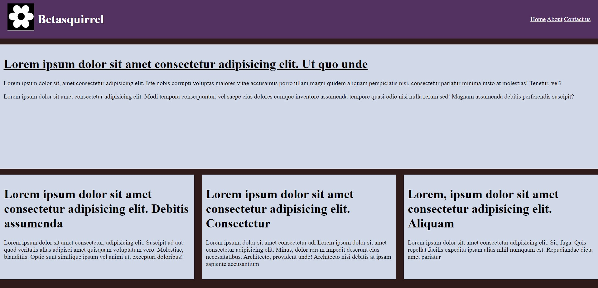
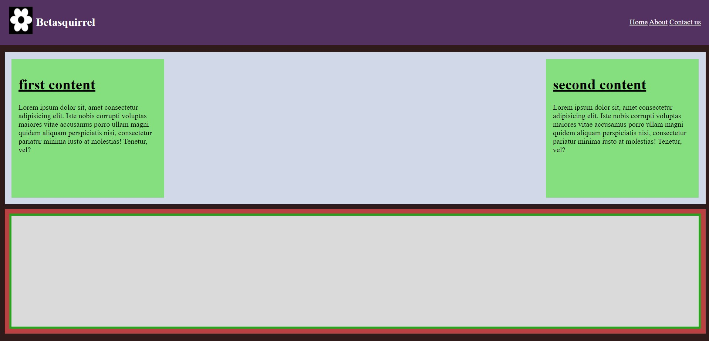
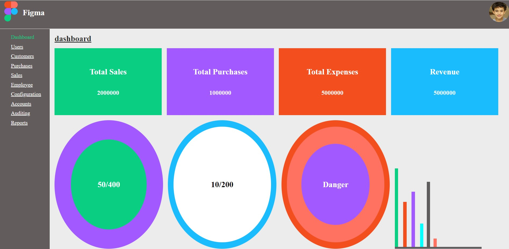

coding-task

assignments

| Requirements                     |  Output                         |
|----------------------------------|---------------------------------|
|||    
||| 
|||

 Task 3

Read the below pages and attend the tests.

- [HTML](https://www.w3schools.com/html/default.asp)
- [HTML ELEMENTS](https://www.w3schools.com/html/html_elements.asp)
- [HTML Attributes](https://www.w3schools.com/html/html_attributes.asp)
- [HTML Headings](https://www.w3schools.com/html/html_headings.asp)
- [HTML Paragraphs](https://www.w3schools.com/html/html_paragraphs.asp)
- [HTML Styles](https://www.w3schools.com/html/html_styles.asp)
- [HTML Formatting](https://www.w3schools.com/html/html_formatting.asp)
- [HTML Quotations](https://www.w3schools.com/html/html_quotation_elements.asp)
- [HTML Comments](https://www.w3schools.com/html/html_comments.asp)
- [HTML Colors](https://www.w3schools.com/html/html_colors.asp)
- [HTML Css](https://www.w3schools.com/html/html_css.asp)
- [HTML Links](https://www.w3schools.com/html/html_links.asp)
- [HTML Images](https://www.w3schools.com/html/html_images.asp)
- [HTML Classes](https://www.w3schools.com/html/html_classes.asp)
- [HTML Id](https://www.w3schools.com/html/html_id.asp)

 ## Linux Commands

 - `cd` - change current directory. Ex: `cd desktop`, `cd ..`
 - `ls` - List contents of a directory. Ex: `ls -a` list hidden files as well.
 - `pwd` - Display current working directory path.
 - `cat` - Display contents of a file. Ex: `cat READ.md`
 - `mkdir` - To create one or more directories.
 - `clear` - To clear git bash.
 - `rm` - To remove file.

 ## GIT Commands

 1. `git config` cofigure git user. Ex: `git config --global user.name "nimisha"`
 2. `git clone` clone a remote git repo to your local.Ex: `git clone https://github.com/nimisha/coding-task.git`
 3. `git add` add your file changes to git. Ex: `git add .`
 4. `git commit` commit changes to git. Ex: `git commit -m "initial commit"`
 5. `git push`  push your local commits to remote repo. Ex: `git push origin main`
 6. `git stash` takes your uncommitted changes,saves them away for later use,and then reverts them from your working copy.
 7. `git pull` is used to fetch and download content from a remote repository and immediately update the local repository to match that content.
 8. `git diff` helps you see,compare,and understand changes in your project.

 Task 5
- [HTML Favicon](https://www.w3schools.com/html/html_favicon.asp)
- [HTML Tables](https://www.w3schools.com/html/html_tables.asp)
- [HTML Table borders](https://www.w3schools.com/html/html_table_borders.asp)
- [HTML Table sizes](https://www.w3schools.com/html/html_table_sizes.asp)
- [HTML Table headers](https://www.w3schools.com/html/html_table_headers.asp)
- [HTML Table padding and spacing](https://www.w3schools.com/html/html_table_padding_spacing.asp)
- [HTML Table colspan and rowspan](https://www.w3schools.com/html/html_table_colspan_rowspan.asp)
- [HTML Table styling](https://www.w3schools.com/html/html_table_styling.asp)
- [HTML Table colgroup](https://www.w3schools.com/html/html_table_colgroup.asp)

  my website

 https://nimishae24.github.io/coding-task

my stackoverflow link

 https://stackoverflow.com/users/21205649/nimisha

 my linkdin link

 https://www.linkedin.com/in/nimisha-e-5a4110266/

 

